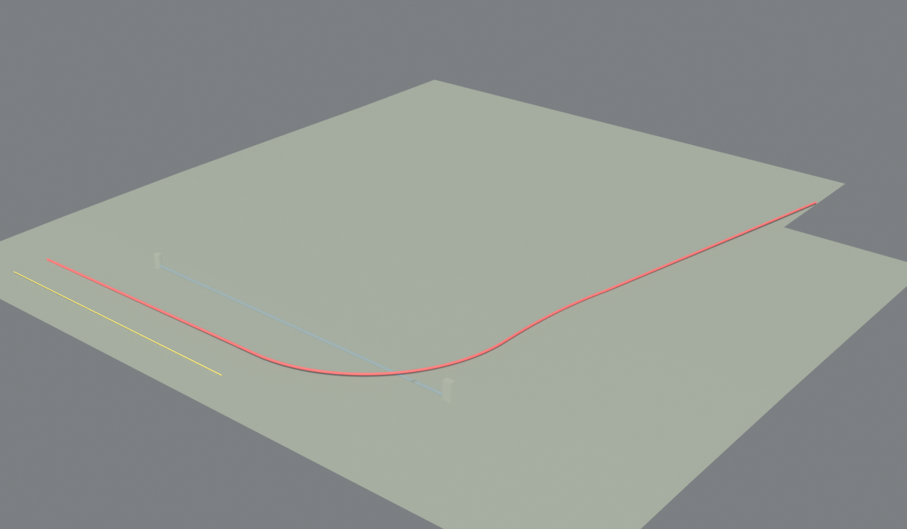
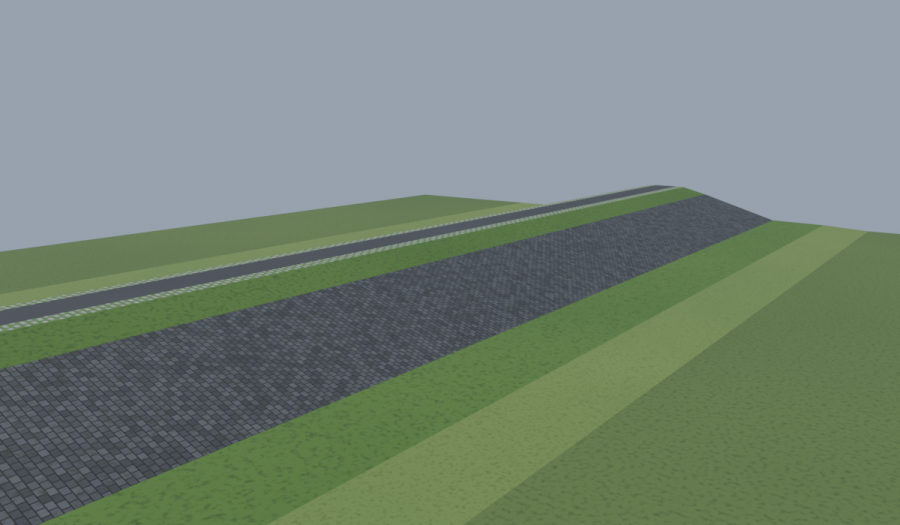
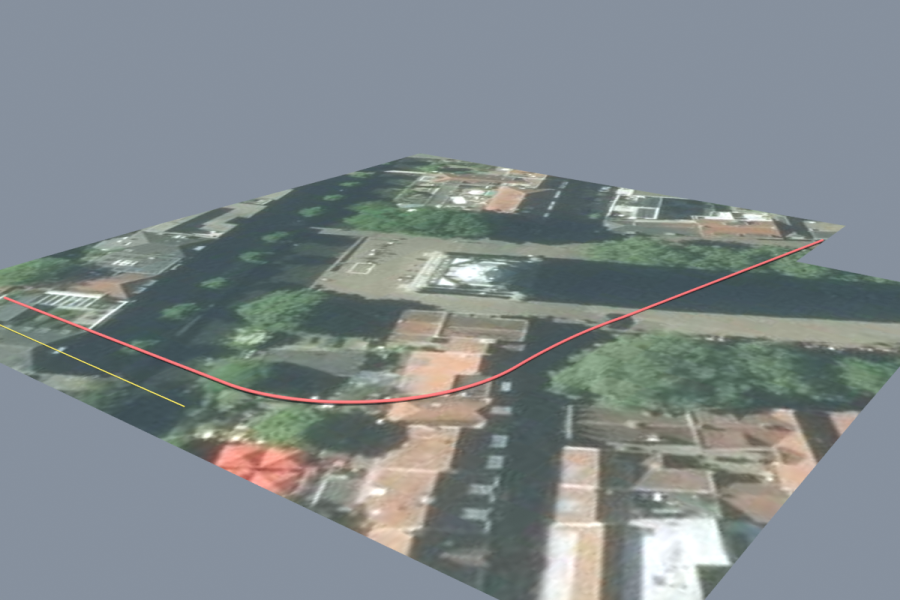
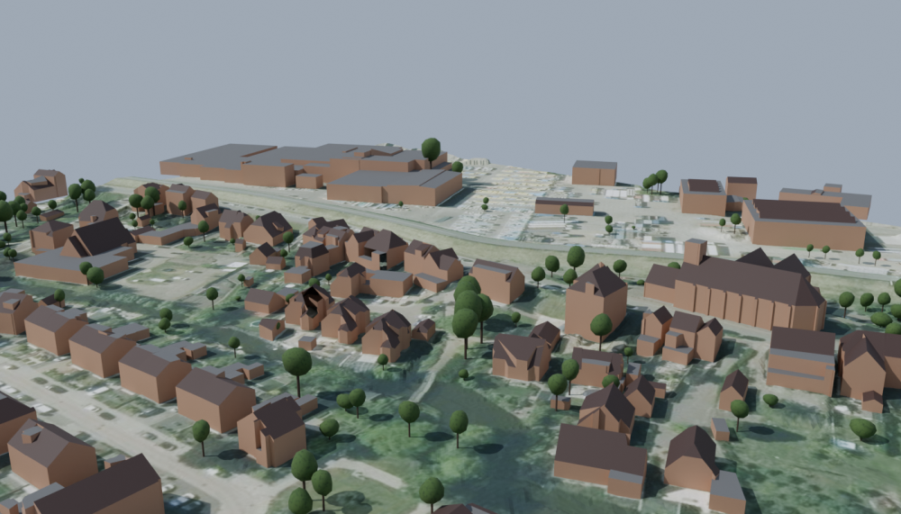
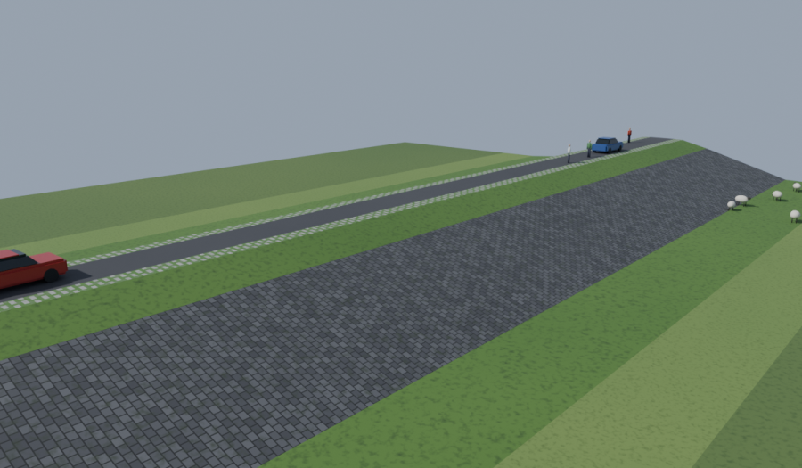
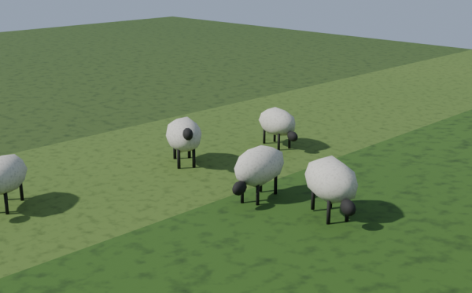
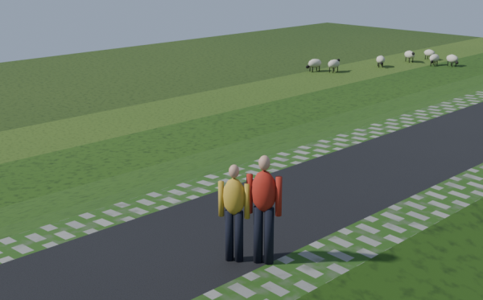

# Civil 3D naar Blender (LandXML-import)

Een gratis Blender-add-on die de **LandXML-export van Civil 3D** inleest en er desgewenst de luchtfoto, de gebouwen en de bomen van de bestaande omgeving bij zet. Je hebt geen FBX- of IFC-export nodig: LandXML zit in elke Civil 3D.



**Stappenplan:** zie [WORKFLOW.md](WORKFLOW.md) voor de hele route van Civil 3D-ontwerp naar render, met een checklist en de meest voorkomende valkuilen.

## Wat wordt ingelezen

| Civil 3D | In Blender |
| --- | --- |
| Surface (TIN) | Mesh, met gaten en randen zoals in Civil 3D, en een materiaal op basis van de naam |
| Pipe network | Putten (rond of rechthoekig, van bodem tot deksel) en leidingen op de juiste BOB |
| Alignment + ontwerpprofiel | 3D-lijn over het lengteprofiel, inclusief verticale bogen |
| Feature line | 3D-lijn |

Leidingen en putten krijgen hun gegevens mee als eigenschappen (BOB begin/eind, diameter, maaiveld, bodem): selecteer een object en kijk bij *Object Properties > Custom Properties*.

## 1. Exporteren uit Civil 3D

1. Tabblad **Uitvoer** (*Output*) > **Exporteren naar LandXML** (*Export to LandXML*).
2. Vink aan wat je mee wilt nemen: surfaces, alignments, pipe networks, feature lines.
3. Sla op als `.xml`.

Werk in meters. Andere eenheden (voet, inch, millimeter voor diameters) worden automatisch omgerekend.

## 2. Add-on installeren in Blender

1. Download `landxml_import.py`.
2. Blender: **Edit > Preferences > Add-ons**, klik rechtsboven op het pijltje ▾ > **Install from Disk…**
3. Kies `landxml_import.py` en zet het vinkje aan bij *LandXML-import (Civil 3D)*.

Daarna staat **LandXML (.xml)** in *File > Import*.

## 3. Importeren

*File > Import > LandXML (.xml)* en kies het bestand.

### Het nulpunt

Blender rekent onnauwkeurig met grote getallen zoals RD-coördinaten (X=155000, Y=463000): het model gaat trillen en flikkeren. De importer verschuift alles daarom naar een lokaal nulpunt: het midden van het model, afgerond op 100 m. Hoogtes (NAP) blijven zoals ze zijn.

- Het nulpunt staat in de scène als object **RD-nulpunt**, met de RD-waarden als eigenschappen `rd_x` en `rd_y`.
- Een volgende import in dezelfde scène gebruikt hetzelfde nulpunt, zodat meerdere bestanden op elkaar aansluiten.
- Wil je zelf een nulpunt kiezen, vul dan *Nulpunt X* en *Nulpunt Y* in het importvenster in.

Een punt in Blender terugrekenen naar RD: `RD-X = Blender-X + rd_x`, `RD-Y = Blender-Y + rd_y`.

## 4. Materialen op naam

Bij het importeren krijgt elke surface automatisch een materiaal op basis van zijn naam:

| Woord in de naam | Materiaal |
| --- | --- |
| Teelaarde, Gras, Berm, Talud, Beloop, Kruin | Gras |
| Beheerstrook | Gemaaid gras (lichter) |
| Zetsteen, Breuksteen, Stortsteen, Steen, Bekleding | Steenzetting (blokken van ca. 40 × 35 cm) |
| Asfalt, Rijbaan, Weg | Asfalt |
| Bermverharding, Grasbeton, Grastegel | Grasbetontegels |
| Fietspad | Rood asfalt |
| Klinker, Bestrating | Klinkers (waalformaat) |
| Beton | Beton |
| Ontgrav(en/ing), Klei, Zand | Grond, klei, zand |
| Water, Sloot, Watergang | Water |
| Maaiveld, Bestaand, Terrein, EG | Bestaand maaiveld |

Het eerste woord dat past wint: *Kruin_Bermverharding* wordt grasbetontegels, niet gras. Surfaces zonder bekend woord krijgen elk een eigen effen kleur.



- Alle surfaces van dezelfde soort delen één materiaal, bijvoorbeeld *Oppervlak gras*. Pas je dat aan, dan verandert al het gras mee.
- **Opnieuw toepassen** (bijvoorbeeld op een bestand dat met een oudere versie is geïmporteerd): selecteer de surfaces (toets **A** in het grote beeld selecteert alles) en kies **Object → Materialen op naam (surfaces)**. Surfaces met een luchtfoto worden overgeslagen.
- Liever effen kleuren? Na het uitvoeren klapt linksonder in het grote beeld een venstertje open. Zet daar **Met textuur** uit.
- De patronen zie je in **Material Preview** (toets **Z**) en in de render, niet in de grijze weergave.

## 5. Luchtfoto op een surface leggen

De add-on kan de luchtfoto van PDOK (gratis, heel Nederland) op een surface leggen, precies op de RD-coördinaten.

1. Selecteer in het grote beeld de surface(s), bijvoorbeeld het bestaande maaiveld. Houd **Shift** ingedrukt om er meer te selecteren.
2. Kies in het menu **Object → Luchtfoto draperen (PDOK)**.
3. Kies de luchtfoto (*Actueel, 25 cm* of de scherpere *Actueel, 8 cm*) en klik **OK**.
4. Zet de weergave op **Material Preview** (toets **Z**) om de foto te zien.

Goed om te weten:

- De luchtfoto's zijn open data van Beeldmateriaal Nederland (via PDOK). Vermeld die bron als je een plaatje deelt.
- Je hebt internet nodig. De foto wordt in het `.blend`-bestand opgeslagen, dus daarna kun je ook offline verder.
- **Alle geselecteerde** surfaces krijgen het materiaal *Luchtfoto*; hun eigen materiaal vervalt. Selecteer dus alleen het maaiveld. Gaat het toch mis, dan zet **Object → Materialen op naam** de andere surfaces weer terug.
- Een luchtfoto laat de **huidige** situatie zien. Leg hem dus op het bestaande maaiveld, niet op een ontwerpsurface.
- Bij een groot gebied wordt de foto automatisch grover, zodat hij niet groter wordt dan *Maximale afmeting* (standaard 4096 pixels). Wil je meer detail, selecteer dan een kleiner gebied of zet die waarde hoger. Dat kost wel meer geheugen.
- Een nieuwe versie van de add-on installeer je op dezelfde manier als de eerste keer (*Install from Disk*). Herstart Blender daarna.



## 6. Gebouwen en bomen rondom

Twee knoppen zetten de bestaande omgeving neer rond de geselecteerde surfaces. Beide halen de gegevens van internet, uit open bronnen voor heel Nederland.



### Gebouwen (3D BAG)

1. Selecteer het maaiveld.
2. Kies **Object → Gebouwen laden (3D BAG)**.
3. Kies het detail: *LoD 2.2* (met dakvormen, standaard), *1.3* (blokken met verschillende dakhoogtes) of *1.2* (één blok per gebouw). Kies ook de marge rond je selectie (standaard 50 m).

Alle gebouwen komen in één object, *Gebouwen (3D BAG)*, met drie materialen: *Gebouw dak* (schuine daken), *Gebouw plat dak* en *Gebouw gevel*. Een gebouw dat gesloopt wordt haal je weg in Edit Mode (**Tab**): wijs het aan, druk op **L** en daarna op **X → Faces**.

Bron: 3D BAG van 3DGI en de TU Delft (CC BY 4.0), gemaakt uit de BAG en het AHN.

### Bomen (AHN)

1. Selecteer **alleen het bestaande maaiveld**.
2. Kies **Object → Bomen plaatsen (AHN)**.
3. Stel de minimale hoogte in (standaard 3 m, zodat struiken en heggen niet meetellen).

Hoe het werkt: het AHN heeft een hoogtekaart van alles (DSM) en een van alleen het maaiveld (DTM). Het verschil is de hoogte van de begroeiing. In dat verschil zoekt de add-on de boomtoppen en meet hij per boom de hoogte en de kruinbreedte. Daarna zet hij er een eenvoudige boom neer.

- **Alleen op de selectie** (standaard aan): er komt alleen een boom waar het geselecteerde maaiveld het bovenste oppervlak is. Bomen op de oude dijk komen dus niet door je nieuwe dijkontwerp heen. De boom staat precies op je maaiveld.
- Onder gebouwen en water heeft het AHN geen maaiveld, en langs gebouwranden zoekt de add-on bewust niet. Zo verschijnen er geen "bomen" op daken of tegen gevels.
- De bomen zijn schetsmatig: een stam en een grillige kruin op de gemeten maat. Ze staan wel op de goede plek en hebben de goede grootte.
- Het gebied mag maximaal 3 × 3 km zijn. Bij een groter gebied selecteer je een deel.

Bron: AHN via PDOK (CC0).

## 7. Aankleden: schapen, mensen en auto's

1. Selecteer de surfaces van je ontwerp. Toets **A** in het grote beeld selecteert alles.
2. Kies **Object → Aankleden (schapen, mensen, auto's)**.
3. Stel de aantallen in en klik **OK**.

| Wat | Waar | Instelling |
| --- | --- | --- |
| **Schapen** | Op gras en beheerstroken, in kuddes van 5 tot 15 | Schapen per hectare gras (standaard 8) |
| **Auto's** | Op asfalt, in de rijrichting, alleen waar de hele auto op de weg past | Auto's per 100 m weg (standaard 1) |
| **Mensen** | Op asfalt en fietspaden, soms met z'n tweeën, nooit in een auto | Mensen per 100 m weg (standaard 1,5) |



 

- Welke surface gras of asfalt is, haalt de add-on uit het materiaal (*Oppervlak gras*, *Oppervlak asfalt*). Gebruik dus eerst **Materialen op naam** als je surfaces die nog niet hebben.
- Er komt alleen iets waar die surface het bovenste oppervlak is, en het staat er precies op.
- **Opnieuw uitvoeren vervangt per soort.** Alleen wat je nu plaatst, wordt vervangen. Selecteer je alleen het gras, of zet je auto's op 0, dan blijven de bestaande auto's en mensen gewoon staan. Niet tevreden met de verdeling? Voer het opnieuw uit met een ander getal bij **Variatie**.
- De figuren zijn maquettestijl: eenvoudige vormen op de juiste maat (schaap ca. 1,2 m, mens ca. 1,75 m, auto ca. 4,3 m). Ze staan in de collectie *Aankleding*, in drie objecten: *Schapen*, *Mensen* en *Auto's*.
- Kleur aanpassen kan via de materialen, bijvoorbeeld *Schaap wol*, *Auto lak 1–6* en *Kleding 1–6*.

## Opdrachtregel

Zonder de Blender-interface, bijvoorbeeld voor een reeks bestanden of als Claude het aanstuurt:

```
blender --background --python landxml_import.py -- invoer.xml uitvoer.blend
```

## Beperkingen

- Overgangsbogen (clothoïdes) in alignments worden benaderd met een vloeiende boog door het snijpunt. Voor visualisatie is dat ruim voldoende, voor maatvoering niet.
- Alignments zonder ontwerpprofiel komen op hoogte 0 te liggen, tenzij er een maaiveldprofiel in het bestand staat.
- Rechthoekige en eivormige leidingen worden als ronde buis getekend, met de grootste maat als diameter.
- Leidingen lopen van hart put tot hart put.
- Corridors staan niet als 3D-model in LandXML. Exporteer de corridor-surfaces (bijvoorbeeld *Top* en *Datum*) als surface, dan komen ze wel mee.

## Testen

`voorbeeld/voorbeeld.xml` is een verzonnen bestand in hetzelfde formaat als een Civil 3D-export. De test draait met de Blender Python-module (`pip install bpy`) of met Blender zelf:

```
python test_landxml.py
blender --background --python test_landxml.py
```
